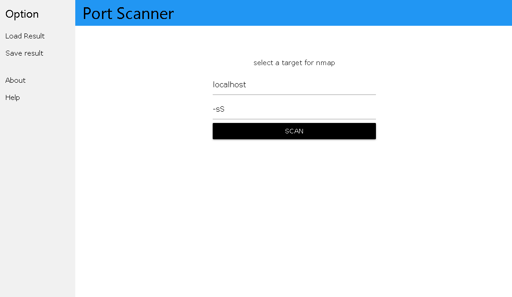
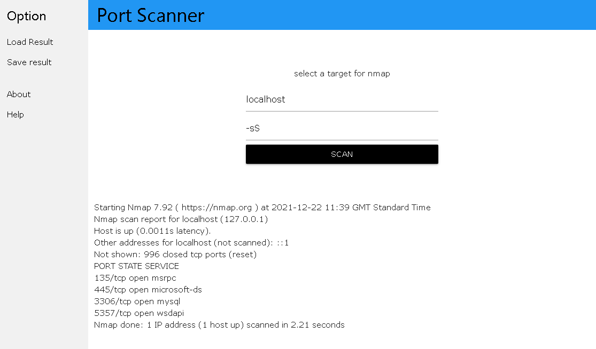

# Port Scanner

This is an application that will allow the user to test the port of any computer in order to identify its vulnerability. This program will search for open ports on a computer or host. For example, administrators can use such an application to validate network security policies.

Main Window



Run scan



## Quick Code Tour

- The code entry point is in **package.json** under the key "main". The value is "main.js"
- 
- **main.js** creates a BrowserWindow and loads **index.html**.

## Releases

At this time the releases are for Windows as that is my main developing platform and where I use this tool mostly; on Windows environments.

[View Releases](https://github.com/Kamel-Ben-Khaled/Port_Scanner)

## Running Application

First download and install dependencies, then start the app.

```bash
git clone https://github.com/Kamel-Ben-Khaled/Port_Scanner
cd net-check
npm install
npm start
